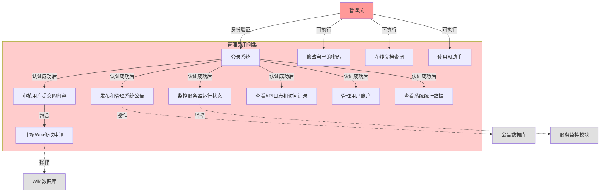
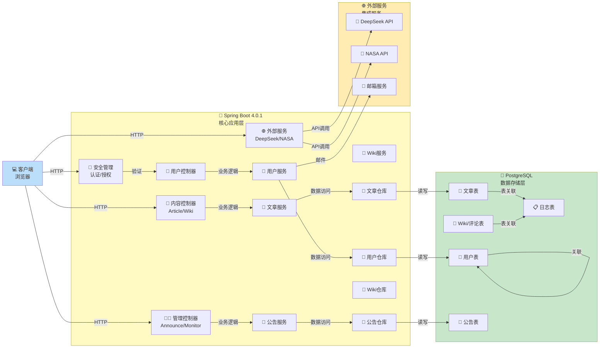
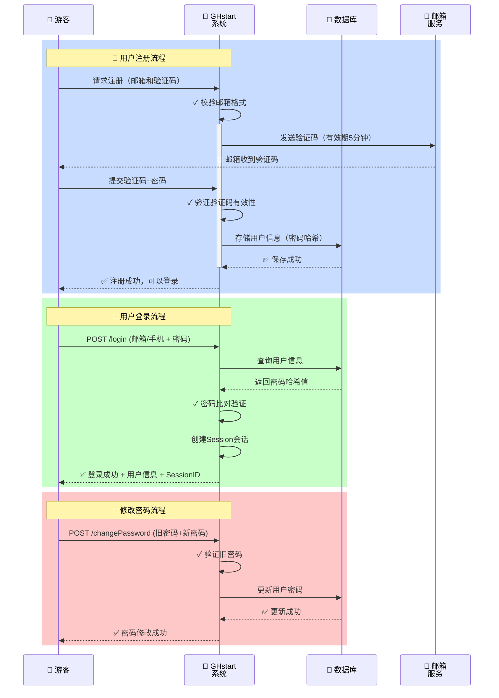
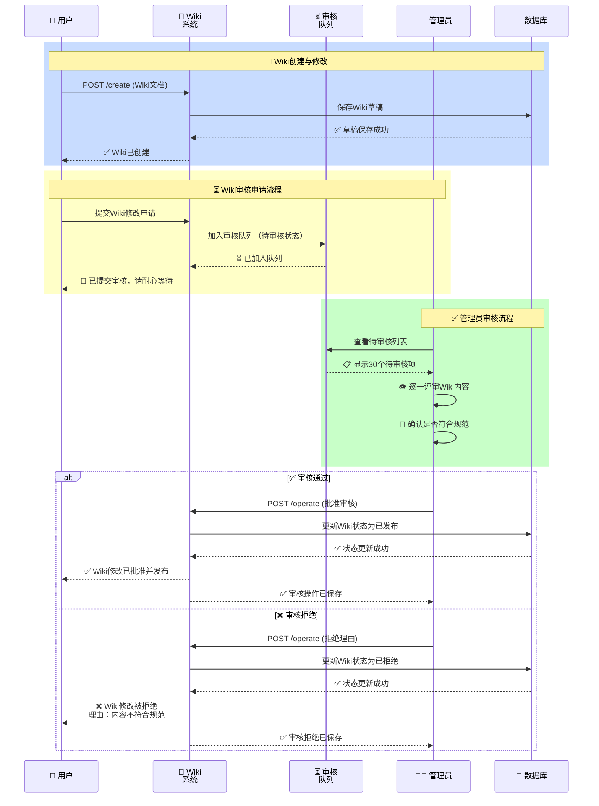

```mermaid
graph TB
    subgraph System["GHstart 系统"]
        direction LR
        
        %% 用户管理
        Login["登录"]
        Register["注册"]
        ChangePassword["修改密码"]
        
        %% 文章管理
        QueryArticle["查询文章"]
        ViewArticleDetail["浏览文章详情"]
        CreateArticle["创建文章"]
        
        %% Wiki管理
        CreateWiki["创建Wiki"]
        QueryWiki["查询Wiki"]
        CommentWiki["评论Wiki"]
        SubmitWikiReview["提交Wiki审核"]
        AuditWikiReview["审核Wiki修改"]
        
        %% 公告管理
        ViewAnnouncement["查看公告"]
        CreateAnnouncement["发布公告"]
        
        %% 监控和数据
        ViewServerInfo["查看服务器信息"]
        QuerySpaceData["查询航天数据"]
        ViewApiLogs["查看API日志"]
        
        %% AI功能
        ChatWithAI["与AI对话"]
        
    end
    
    %% 外部系统
    DeepSeekAPI["DeepSeek API"]
    Database["PostgreSQL<br/>数据库"]
    
    %% 角色
    Admin["<br/>管理员"]
    User["<br/>注册用户"]
    Guest["<br/>游客"]
    
    %% 关系
    Guest -->|使用| Login
    Guest -->|使用| Register
    Guest -->|使用| QueryArticle
    Guest -->|使用| ViewArticleDetail
    Guest -->|使用| ViewAnnouncement
    Guest -->|使用| QuerySpaceData
    
    User -->|使用| Login
    User -->|使用| ChangePassword
    User -->|使用| QueryArticle
    User -->|使用| ViewArticleDetail
    User -->|使用| CreateWiki
    User -->|使用| QueryWiki
    User -->|使用| CommentWiki
    User -->|使用| SubmitWikiReview
    User -->|使用| ViewAnnouncement
    User -->|使用| QuerySpaceData
    User -->|使用| ChatWithAI
    
    Admin -->|使用| Login
    Admin -->|使用| ChangePassword
    Admin -->|使用| CreateAnnouncement
    Admin -->|使用| ViewAnnouncement
    Admin -->|使用| AuditWikiReview
    Admin -->|使用| ViewServerInfo
    Admin -->|使用| ViewApiLogs
    Admin -->|使用| ChatWithAI
    
    ChatWithAI -->|调用| DeepSeekAPI
    System -->|读写| Database
    
    style System fill:#e1f5ff
    style Admin fill:#ffcccc
    style User fill:#ccffcc
    style Guest fill:#ffffcc
    style DeepSeekAPI fill:#f0f0f0
    style Database fill:#f0f0f0
```

```mermaid
graph TB
    subgraph UserUseCases["👤 注册用户用例集"]
        direction LR
        
        CreateContent["✍️ 创建内容"]
        CreateWiki["📰 创建Wiki文档"]
        PublishArticle["📄 发布文章"]
        
        ReviewContent["⏳ 参与审核流程"]
        SubmitWikiReview["📋 提交Wiki修改审核"]
        
        EngageWithCommunity["💬 社区交互"]
        CommentOnWiki["💭 评论Wiki提高互动"]
        ViewComments["👁️ 查看他人评论"]
        
        SelfManagement["⚙️ 自我管理"]
        UpdateProfile["👤 更新个人信息"]
        ChangePassword["🔑 修改密码"]
        ManageAchievements["🏆 管理成就记录"]
        
        RetrievInfo["🔍 获取信息"]
        BrowseArticles["📚 浏览文章库"]
        QueryWiki["📖 查询Wiki数据库"]
        ViewAnnouncements["📢 查看系统公告"]
        CheckSpaceNews["🛸 查看航天新闻"]
        
        UseAI["🤖 使用AI功能"]
        ChatWithAI["💬 调用DeepSeek AI"]
        
    end
    
    User["👤 注册用户"]
    
    User -->|执行| CreateContent
    CreateContent -->|包含| CreateWiki
    CreateContent -->|包含| PublishArticle
    
    User -->|执行| ReviewContent
    ReviewContent -->|包含| SubmitWikiReview
    
    User -->|执行| EngageWithCommunity
    EngageWithCommunity -->|包含| CommentOnWiki
    EngageWithCommunity -->|包含| ViewComments
    
    User -->|执行| SelfManagement
    SelfManagement -->|包含| UpdateProfile
    SelfManagement -->|包含| ChangePassword
    SelfManagement -->|包含| ManageAchievements
    
    User -->|执行| RetrievInfo
    RetrievInfo -->|包含| BrowseArticles
    RetrievInfo -->|包含| QueryWiki
    RetrievInfo -->|包含| ViewAnnouncements
    RetrievInfo -->|包含| CheckSpaceNews
    
    User -->|执行| UseAI
    UseAI -->|调用| ChatWithAI
    
    CreateWiki -.->|数据存储| WikiDB["📰 Wiki库"]
    PublishArticle -.->|数据存储| ArticleDB["📄 文章库"]
    CommentOnWiki -.->|数据存储| CommentDB["💬 评论库"]
    SubmitWikiReview -.->|提交至| ReviewQueue["⏳ 审核队列"]
    
    style UserUseCases fill:#ccffcc
    style User fill:#99ff99
    style WikiDB fill:#e0e0e0
    style ArticleDB fill:#e0e0e0
    style CommentDB fill:#e0e0e0
    style ReviewQueue fill:#e0e0e0
```

```mermaid
graph TB
    subgraph GuestUseCases["👥 游客用例集"]
        direction LR
        
        AccessInfo["🔓 获取系统信息"]
        ViewArticles["📚 浏览文章库"]
        ReadArticleDetail["📖 阅读完整文章"]
        SearchArticles["🔍 按标题和标签搜索"]
        
        ViewWiki["📰 查看Wiki文档"]
        QueryWiki["🔎 查询Wiki内容"]
        ViewWikiComments["💬 查看Wiki评论"]
        
        ViewAnnouncements["📢 查看公告信息"]
        GetLatestNews["🆕 获取最新公告"]
        ViewAnnouncementHistory["📜 查看历史公告"]
        
        AccessExternalData["🌐 访问外部数据"]
        CheckSpaceData["🛸 查看最新航天发射数据"]
        ViewNasaImages["🌌 查看NASA每日图片"]
        QueryMissions["🚀 查询航天任务"]
        
        AccountOperations["🔐 账户操作"]
        UserLogin["🔐 登录系统"]
        UserRegister["📝 注册新账户"]
        
    end
    
    Guest["👥 游客<br/>未认证用户"]
    
    Guest -->|可执行| AccessInfo
    AccessInfo -->|包含| ViewArticles
    AccessInfo -->|包含| ViewWiki
    AccessInfo -->|包含| ViewAnnouncements
    
    ViewArticles -->|包含| ReadArticleDetail
    ViewArticles -->|包含| SearchArticles
    
    ViewWiki -->|包含| QueryWiki
    ViewWiki -->|包含| ViewWikiComments
    
    ViewAnnouncements -->|包含| GetLatestNews
    ViewAnnouncements -->|包含| ViewAnnouncementHistory
    
    Guest -->|可执行| AccessExternalData
    AccessExternalData -->|包含| CheckSpaceData
    AccessExternalData -->|包含| ViewNasaImages
    AccessExternalData -->|包含| QueryMissions
    
    Guest -->|可执行| AccountOperations
    AccountOperations -->|包含| UserLogin
    AccountOperations -->|包含| UserRegister
    
    UserLogin -.->|上升到| User["👤 注册用户"]
    UserRegister -.->|转变为| User
    
    ViewArticles -.->|查询| ArticleDB["📄 文章库"]
    QueryWiki -.->|查询| WikiDB["📰 Wiki库"]
    ViewAnnouncements -.->|查询| AnnouncementDB["📢 公告库"]
    CheckSpaceData -.->|查询| SpaceDB["🛸 航天数据库"]
    ViewNasaImages -.->|查询| NasaDB["🌌 NASA数据"]
    
    style GuestUseCases fill:#ffffcc
    style Guest fill:#ffff99
    style User fill:#99ff99
    style ArticleDB fill:#e0e0e0
    style WikiDB fill:#e0e0e0
    style AnnouncementDB fill:#e0e0e0
    style SpaceDB fill:#e0e0e0
    style NasaDB fill:#e0e0e0
```

# GHstart 系统用例建模 - Mermaid代码库

> 本文档包含所有Mermaid Live可直接识别和渲染的用例图代码
> 复制下方代码到 https://mermaid.live 即可查看完整图表

---

## 1. 系统整体用例图 🎯

**描述**: 展示整个GHstart系统的所有主要用例及三个角色的交互

**复制此代码到 Mermaid Live**:



---

## 2. 管理员用例图 👨‍💼

**描述**: 专门展示管理员需要执行的所有操作

**复制此代码到 Mermaid Live**:



---

## 3. 注册用户用例图 👤

**描述**: 展示已登录注册用户可以执行的所有操作

**复制此代码到 Mermaid Live**:



---

## 4. 游客用例图 👥

**描述**: 展示未登录游客可以访问的所有公开功能

**复制此代码到 Mermaid Live**:



---

## 5. 系统架构与模块依赖图 🏗️

**描述**: 展示系统各个模块之间的联系和依赖关系

**复制此代码到 Mermaid Live**:



---

## 6. 用户认证流程序列图 🔐

**描述**: 详细展示用户登录的业务流程

**复制此代码到 Mermaid Live**:



---

## 7. Wiki内容审核流程 📋

**描述**: 展示Wiki内容从创建到发布的完整审核流程

**复制此代码到 Mermaid Live**:



---

## 🎓 使用说明

### 如何在 Mermaid Live 中查看图表

1. **访问网站**: 前往 https://mermaid.live
2. **复制代码**: 选择上方任一代码块，全部复制
3. **粘贴**: 粘贴到 Mermaid Live 的左侧编辑框
4. **实时预览**: 右侧自动显示用例图

### 图表说明

| 图号 | 名称 | 用途 | 受众 |
|-----|------|------|-----|
| 1️⃣ | 系统整体用例图 | 系统全景、展示三个角色与所有用例的关系 | 项目经理、架构师、团队全体 |
| 2️⃣ | 管理员用例图 | 管理员能执行的所有操作细节 | 系统管理员、产品经理 |
| 3️⃣ | 用户用例图 | 注册用户的完整权限和功能清单 | 终端用户、开发人员 |
| 4️⃣ | 游客用例图 | 未登录用户的公开访问范围 | 营销、产品设计 |
| 5️⃣ | 系统架构图 | 技术层面的模块依赖和集成关系 | 架构师、后端开发、DBA |
| 6️⃣ | 认证流程序列图 | 登录、注册、修改密码的业务流程 | 前端开发、后端开发 |
| 7️⃣ | Wiki审核流程 | Wiki从创建到发布的品质管理流程 | 内容管理、审核团队 |

### 💡 图表自定义

所有Mermaid代码都可根据需要修改：
- 修改节点颜色: `fill:#ffffff`
- 修改样式: `style NodeName fill:#color`
- 添加新用例: 直接在相应分组中添加新节点
- 修改箭头文字: `-->|文字|` 修改为需要的描述

---

## 📊 系统权限与功能对应表

```
┌────────────────────────────────────────┬──────┬───────┬──────┐
│              功能模块                   │ 游客 │ 用户  │ 管理员│
├────────────────────────────────────────┼──────┼───────┼──────┤
│ 登录 / 注册                              │  ✅  │  ✅   │  ✅  │
│ 修改密码                                 │  ❌  │  ✅   │  ✅  │
│ 查看公开文章 (查询/浏览详情)             │  ✅  │  ✅   │  ✅  │
│ 创建/编辑 Wiki 文档                     │  ❌  │  ✅   │  ✅  │
│ 评论 Wiki 内容                          │  ❌  │  ✅   │  ✅  │
│ 提交 Wiki 修改审核申请                  │  ❌  │  ✅   │  ✅  │
│ 审核 Wiki 修改（最终批准/拒绝）         │  ❌  │  ❌   │  ✅  │
│ 发布/管理系统公告                       │  ❌  │  ❌   │  ✅  │
│ 查看服务器信息和 API 日志               │  ❌  │  ❌   │  ✅  │
│ 查看航天数据 / NASA 图片                │  ✅  │  ✅   │  ✅  │
│ 调用 AI 对话功能 (DeepSeek)             │  ❌  │  ✅   │  ✅  │
└────────────────────────────────────────┴──────┴───────┴──────┘
```

---

## 🚀 快速 API 参考

### 🔓 公开接口（游客可访问）

```bash
# 用户认证
POST   /GHapi/user/login              # 登录
POST   /GHapi/user/register/sendCode  # 发送注册验证码
POST   /GHapi/user/register/verify    # 完成注册

# 内容查看
POST   /GHapi/article/query           # 查询文章列表（支持分页搜索）
GET    /GHapi/article/{articleId}     # 获取完整文章内容

POST   /GHapi/wiki/query              # 查询Wiki列表

# 公告
GET    /GHapi/announcement/latest     # 获取最新1条公告
GET    /GHapi/announcement/recent     # 获取最近5条公告

# 外部数据
GET    /GHapi/recent-launch/latest    # 获取最新航天发射数据
GET    /GHapi/nasa-daily-image/latest # 获取NASA每日图片
```

### 🔐 受保护接口（需认证）

```bash
# 用户相关
POST   /GHapi/user/changePassword     # 修改密码（认证用户）

# Wiki相关
POST   /GHapi/wiki/create             # 创建Wiki（认证用户）
POST   /GHapi/wiki-comment/create     # 添加Wiki评论（认证用户）
POST   /GHapi/wiki-review/create      # 提交Wiki修改审核（认证用户）

# AI功能
POST   /GHapi/deepseek/chat           # AI对话（认证用户）
POST   /GHapi/deepseek/chat-custom    # AI自定义参数对话（认证用户）
```

### 👨‍💼 管理员专用接口

```bash
# 公告管理
POST   /GHapi/announcement/add        # 发布新公告

# Wiki审核
POST   /GHapi/wiki-review/operate     # 批准/拒绝Wiki审核申请
GET    /GHapi/wiki-review/list        # 查看待审核列表

# 服务监控
GET    /GHapi/serverinfo/overview     # 获取服务器概览（JVM、内存、线程）
POST   /GHapi/serverinfo/api-logs     # 查询API日志（系统范围）

# 用户日志
GET    /GHapi/serverinfo/user-logs    # 查看用户活动日志
```

