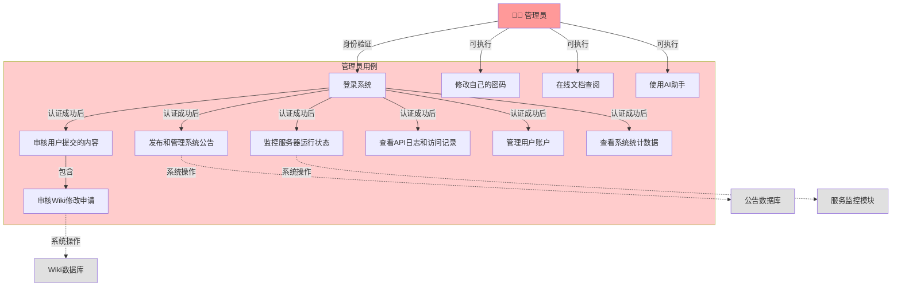
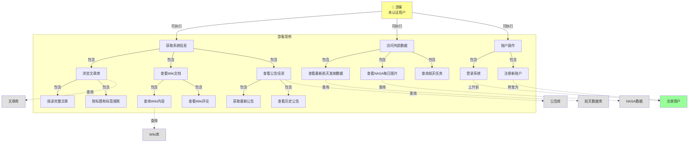
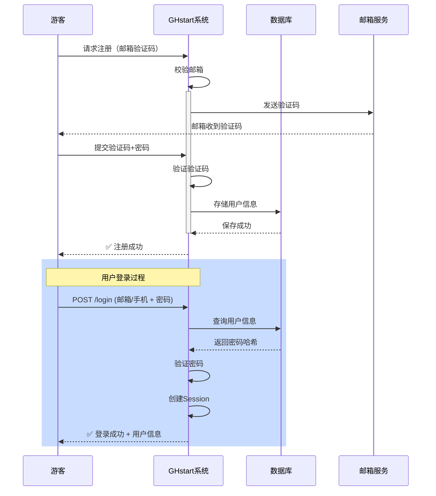
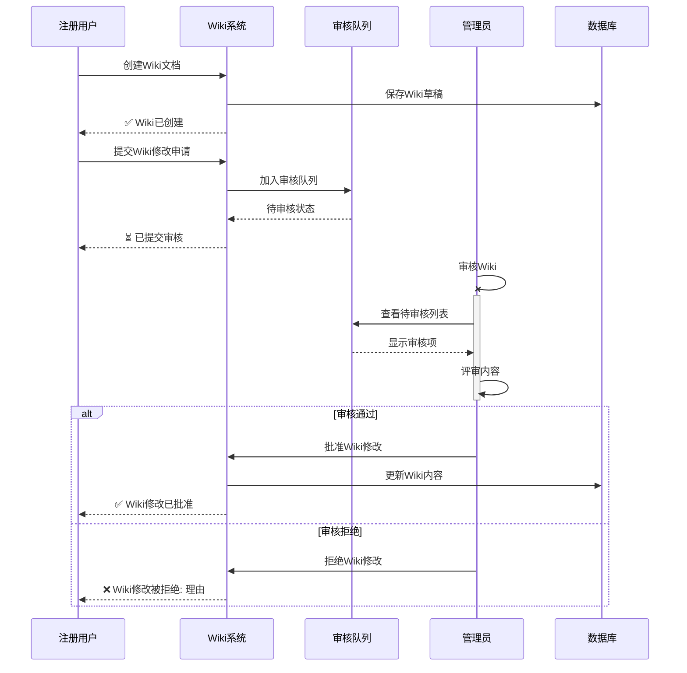
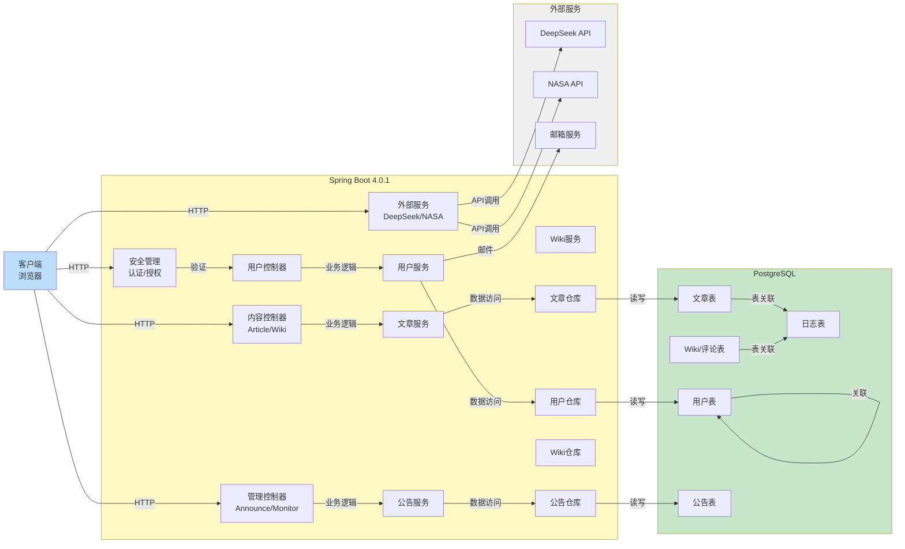

# GHstart 系统用例建模

## 1️⃣ 系统整体用例图

```mermaid
graph TB
    subgraph System["GHstart 系统"]
        direction LR
        
        %% 用户管理
        Login["🔐 登录"]
        Register["📝 注册"]
        ChangePassword["🔑 修改密码"]
        
        %% 文章管理
        QueryArticle["📄 查询文章"]
        ViewArticleDetail["👁️ 浏览文章详情"]
        CreateArticle["✍️ 创建文章"]
        
        %% Wiki管理
        CreateWiki["📰 创建Wiki"]
        QueryWiki["🔍 查询Wiki"]
        CommentWiki["💬 评论Wiki"]
        SubmitWikiReview["⏳ 提交Wiki审核"]
        AuditWikiReview["✅ 审核Wiki修改"]
        
        %% 公告管理
        ViewAnnouncement["📢 查看公告"]
        CreateAnnouncement["🚀 发布公告"]
        
        %% 监控和数据
        ViewServerInfo["📊 查看服务器信息"]
        QuerySpaceData["🛸 查询航天数据"]
        ViewApiLogs["📋 查看API日志"]
        
        %% AI功能
        ChatWithAI["🤖 与AI对话"]
        
    end
    
    %% 外部系统
    DeepSeekAPI["DeepSeek API"]
    Database["PostgreSQL<br/>数据库"]
    
    %% 角色
    Admin["👨‍💼<br/>管理员"]
    User["👤<br/>注册用户"]
    Guest["👥<br/>游客"]
    
    %% 关系
    Guest -->|使用| Login
    Guest -->|使用| Register
    Guest -->|使用| QueryArticle
    Guest -->|使用| ViewArticleDetail
    Guest -->|使用| ViewAnnouncement
    Guest -->|使用| QuerySpaceData
    
    User -->|使用| Login
    User -->|使用| ChangePassword
    User -->|使用| QueryArticle
    User -->|使用| ViewArticleDetail
    User -->|使用| CreateWiki
    User -->|使用| QueryWiki
    User -->|使用| CommentWiki
    User -->|使用| SubmitWikiReview
    User -->|使用| ViewAnnouncement
    User -->|使用| QuerySpaceData
    User -->|使用| ChatWithAI
    
    Admin -->|使用| Login
    Admin -->|使用| ChangePassword
    Admin -->|使用| CreateAnnouncement
    Admin -->|使用| ViewAnnouncement
    Admin -->|使用| AuditWikiReview
    Admin -->|使用| ViewServerInfo
    Admin -->|使用| ViewApiLogs
    Admin -->|使用| ChatWithAI
    
    ChatWithAI -->|调用| DeepSeekAPI
    System -->|读写| Database
    
    style System fill:#e1f5ff
    style Admin fill:#ffcccc
    style User fill:#ccffcc
    style Guest fill:#ffffcc
    style DeepSeekAPI fill:#f0f0f0
    style Database fill:#f0f0f0
```



---

## 2️⃣ 管理员用例图



---

## 3️⃣ 注册用户用例图

```mermaid
graph TB
    subgraph UserUseCases["注册用户用例"]
        direction LR
        
        CreateContent["创建内容"]
        CreateWiki["创建Wiki文档"]
        PublishArticle["发布文章"]
        
        ReviewContent["参与审核流程"]
        SubmitWikiReview["提交Wiki修改审核"]
        
        EngageWithCommunity["社区交互"]
        CommentOnWiki["评论Wiki提高互动"]
        ViewComments["查看他人评论"]
        
        SelfManagement["自我管理"]
        UpdateProfile["更新个人信息"]
        ChangePassword["修改密码"]
        ManageAchievements["管理成就记录"]
        
        RetrievInfo["获取信息"]
        BrowseArticles["浏览文章库"]
        QueryWiki["查询Wiki数据库"]
        ViewAnnouncements["查看系统公告"]
        CheckSpaceNews["查看航天新闻"]
        
        UseAI["使用AI功能"]
        ChatWithAI["调用DeepSeek AI"]
        
    end
    
    User["👤 注册用户"]
    
    User -->|执行| CreateContent
    CreateContent -->|包含| CreateWiki
    CreateContent -->|包含| PublishArticle
    
    User -->|执行| ReviewContent
    ReviewContent -->|包含| SubmitWikiReview
    
    User -->|执行| EngageWithCommunity
    EngageWithCommunity -->|包含| CommentOnWiki
    EngageWithCommunity -->|包含| ViewComments
    
    User -->|执行| SelfManagement
    SelfManagement -->|包含| UpdateProfile
    SelfManagement -->|包含| ChangePassword
    SelfManagement -->|包含| ManageAchievements
    
    User -->|执行| RetrievInfo
    RetrievInfo -->|包含| BrowseArticles
    RetrievInfo -->|包含| QueryWiki
    RetrievInfo -->|包含| ViewAnnouncements
    RetrievInfo -->|包含| CheckSpaceNews
    
    User -->|执行| UseAI
    UseAI -->|调用| ChatWithAI
    
    CreateWiki -.->|数据存储| WikiDB["Wiki库"]
    PublishArticle -.->|数据存储| ArticleDB["文章库"]
    CommentOnWiki -.->|数据存储| CommentDB["评论库"]
    SubmitWikiReview -.->|提交至| ReviewQueue["审核队列"]
    
    style UserUseCases fill:#ccffcc
    style User fill:#99ff99
    style WikiDB fill:#e0e0e0
    style ArticleDB fill:#e0e0e0
    style CommentDB fill:#e0e0e0
    style ReviewQueue fill:#e0e0e0
```



---

## 4️⃣ 游客用例图



---

## 5️⃣ 系统用例详细关系图

```mermaid
graph TB
    subgraph System["GHstart 系统架构"]
        direction TB
        
        subgraph UserMgmt["用户管理模块"]
            Login["登录"]
            Register["注册"]
            Auth["身份验证"]
            ChangePass["修改密码"]
        end
        
        subgraph ContentMgmt["内容管理模块"]
            Article["文章系统"]
            Wiki["Wiki系统"]
            Comment["评论系统"]
            Review["审核系统"]
        end
        
        subgraph SystemAdmin["系统管理模块"]
            Announce["公告管理"]
            Monitor["服务监控"]
            Logs["日志记录"]
        end
        
        subgraph ExternalService["外部服务集成"]
            DeepSeek["DeepSeek AI"]
            NASA["NASA数据"]
            SpaceLaunch["航天发射数据"]
        end
        
        DB["PostgreSQL<br/>数据库"]
    end
    
    %% 角色
    Guest["👥 游客"]
    User["👤 用户"]
    Admin["👨‍💼 管理员"]
    
    %% 游客访问
    Guest -->|公开接口| Login
    Guest -->|公开接口| Register
    Guest -->|公开接口| Article
    Guest -->|公开接口| Wiki
    Guest -->|公开接口| Announce
    Guest -->|公开接口| NASA
    Guest -->|公开接口| SpaceLaunch
    
    %% 用户访问
    User -->|认证接口| Auth
    User -->|内容创建| Article
    User -->|内容创建| Wiki
    User -->|交互| Comment
    User -->|提交| Review
    User -->|个人操作| ChangePass
    User -->|数据查询| Article
    User -->|数据查询| Wiki
    User -->|功能| DeepSeek
    
    %% 管理员访问
    Admin -->|管理操作| Announce
    Admin -->|管理操作| Monitor
    Admin -->|管理操作| Review
    Admin -->|查看| Logs
    Admin -->|认证| Auth
    Admin -->|个人操作| ChangePass
    
    %% 数据流
    UserMgmt -->|存储| DB
    ContentMgmt -->|存储| DB
    SystemAdmin -->|存储| DB
    ExternalService -->|集成| DB
    
    style System fill:#e3f2fd
    style UserMgmt fill:#fff9c4
    style ContentMgmt fill:#c8e6c9
    style SystemAdmin fill:#ffcccc
    style ExternalService fill:#f0f0f0
    style Guest fill:#fff59d
    style User fill:#a5d6a7
    style Admin fill:#ef9a9a
    style DB fill:#bdbdbd
```



---

## 📋 用例说明表

| 序号 | 用例名称 | 描述 | 访问角色 | API端点 | 认证需求 |
|------|--------|------|---------|--------|--------|
| 1 | 登录 | 用户通过邮箱/手机+密码登录系统 | 游客、用户、管理员 | POST `/GHapi/user/login` | ❌ |
| 2 | 注册 | 新用户通过邮箱验证完成注册 | 游客 | POST `/GHapi/user/register/sendCode` | ❌ |
| 3 | 修改密码 | 用户修改账户密码 | 用户、管理员 | POST `/GHapi/user/changePassword` | ✅ |
| 4 | 查询文章 | 分页查询文章，支持按标题和标签搜索 | 游客、用户、管理员 | POST `/GHapi/article/query` | ❌ |
| 5 | 浏览文章 | 获取完整文章内容 | 游客、用户、管理员 | GET `/GHapi/article/{articleId}` | ❌ |
| 6 | 创建Wiki | 用户创建新的Wiki文档 | 用户、管理员 | POST `/GHapi/wiki/create` | ✅ |
| 7 | 查询Wiki | 查询Wiki内容和信息 | 游客、用户、管理员 | POST `/GHapi/wiki/query` | ❌ |
| 8 | 评论Wiki | 用户对Wiki添加评论 | 用户、管理员 | POST `/GHapi/wiki-comment/create` | ✅ |
| 9 | 提交Wiki审核 | 用户提交Wiki修改进行审核 | 用户、管理员 | POST `/GHapi/wiki-review/create` | ✅ |
| 10 | 审核Wiki | 管理员审核Wiki修改申请 | 管理员 | POST `/GHapi/wiki-review/operate` | ✅ |
| 11 | 查看公告 | 获取最新或最近的系统公告 | 游客、用户、管理员 | GET `/GHapi/announcement/latest` | ❌ |
| 12 | 发布公告 | 管理员发布系统公告 | 管理员 | POST `/GHapi/announcement/add` | ✅ |
| 13 | 查看服务器信息 | 查看JVM和服务器运行状态 | 管理员 | GET `/GHapi/serverinfo/overview` | ✅ |
| 14 | 查看API日志 | 查看系统API访问日志 | 管理员 | POST `/GHapi/serverinfo/api-logs` | ✅ |
| 15 | 查询航天数据 | 获取最新航天发射数据 | 游客、用户、管理员 | GET `/GHapi/recent-launch/latest` | ❌ |
| 16 | 查看NASA图片 | 获取NASA每日图片 | 游客、用户、管理员 | GET `/GHapi/nasa-daily-image/latest` | ❌ |
| 17 | AI对话 | 使用DeepSeek AI进行对话 | 用户、管理员 | POST `/GHapi/deepseek/chat` | ✅ |

---

## 🔐 权限矩阵

```
┌─────────────────────────────────────┬───────┬──────┬───────┐
│           功能模块                   │ 游客  │ 用户 │ 管理员│
├─────────────────────────────────────┼───────┼──────┼───────┤
│ 登录 / 注册                           │  ✅   │  ✅  │  ✅  │
│ 修改密码                              │  ❌   │  ✅  │  ✅  │
│ 查看公开文章                          │  ✅   │  ✅  │  ✅  │
│ 创建/编辑Wiki                        │  ❌   │  ✅  │  ✅  │
│ 评论Wiki内容                         │  ❌   │  ✅  │  ✅  │
│ 提交Wiki审核申请                     │  ❌   │  ✅  │  ✅  │
│ 审核Wiki修改（最终）                 │  ❌   │  ❌  │  ✅  │
│ 发布/管理公告                        │  ❌   │  ❌  │  ✅  │
│ 查看服务器信息和日志                 │  ❌   │  ❌  │  ✅  │
│ 查看航天数据/NASA图片                │  ✅   │  ✅  │  ✅  │
│ 调用AI对话功能                       │  ❌   │  ✅  │  ✅  │
└─────────────────────────────────────┴───────┴──────┴───────┘
```

---

## 🎯 核心业务流程

### 📝 用户注册和登录流程



### 📰 Wiki创建和审核流程



---

## 📊 系统模块依赖关系



---

## 🚀 快速参考

### 主要API端点分类

**认证相关（公开接口）**
```
POST   /GHapi/user/login              - 用户登录
POST   /GHapi/user/register/sendCode  - 发送注册验证码
POST   /GHapi/user/register/verify    - 完成注册
```

**内容查看（公开接口）**
```
POST   /GHapi/article/query           - 查询文章列表
GET    /GHapi/article/{articleId}     - 获取文章详情
POST   /GHapi/wiki/query              - 查询Wiki列表
GET    /GHapi/announcement/latest     - 获取最新公告
GET    /GHapi/announcement/recent     - 获取最近5条公告
```

**外部数据（公开接口）**
```
GET    /GHapi/recent-launch/latest    - 获取最新发射数据
GET    /GHapi/nasa-daily-image/latest - 获取NASA每日图片
```

**用户操作（需认证）**
```
POST   /GHapi/user/changePassword     - 修改密码
POST   /GHapi/wiki/create             - 创建Wiki
POST   /GHapi/wiki-comment/create     - 添加Wiki评论
POST   /GHapi/wiki-review/create      - 提交审核申请
POST   /GHapi/deepseek/chat           - AI对话
```

**管理操作（仅管理员）**
```
POST   /GHapi/announcement/add        - 发布公告
POST   /GHapi/wiki-review/operate     - 审核Wiki修改
GET    /GHapi/serverinfo/overview     - 服务器概览
POST   /GHapi/serverinfo/api-logs     - API日志查询
```

